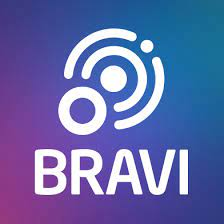

<div id="top"></div>

<!-- PROJECT LOGO -->
<br />
<div align="center">
  <a href="https://github.com/github_username/repo_name">
    
  </a>

<h3 align="center"><strong>Bravi People</strong></h3>

  <p align="center">
    An app that allows you to store people and their contacts.
    <br />
    <a href="https://github.com/github_username/repo_name">View App</a>
    ·
    <a href="mailto:emerson.yur@gmail.com">Get in touch</a>
  </p>
</div>

<!-- TABLE OF CONTENTS -->
<details>
  <summary>Table of Contents</summary>
  <ol>
    <li>
      <a href="#about-the-project">About The Project</a>
      <ul>
        <li><a href="#built-with">Built With</a></li>
      </ul>
    </li>
    <li>
      <a href="#getting-started">Getting Started</a>
      <ul>
        <li><a href="#prerequisites">Prerequisites</a></li>
        <li><a href="#installation">Installation</a></li>
      </ul>
    </li>
    <li><a href="#usage">Usage</a></li>
    <li><a href="#roadmap">Roadmap</a></li>
    <li><a href="#contributing">Contributing</a></li>
    <li><a href="#license">License</a></li>
    <li><a href="#contact">Contact</a></li>
    <li><a href="#acknowledgments">Acknowledgments</a></li>
  </ol>
</details>

<!-- ABOUT THE PROJECT -->

## About The Project

[![Product Name Screen Shot][product-screenshot]](https://example.com)

A Progressive Web Application that allows any user to search, save, update and delete contacts.


### Built With

- [React.js](https://reactjs.org/)
- [NEST.js](https://nestjs.com/)
- [PostgreSQL](https://www.postgresql.org/)


<!-- GETTING STARTED -->

## Getting Started
To get a local copy up and running follow these simple steps:

### Prerequisites
Before trying to run the project you should have installed [Node.JS](https://nodejs.org/en/download/), [Yarn](https://classic.yarnpkg.com/lang/en/docs/install/#windows-stable) Package Manager and [Docker](https://docs.docker.com/desktop/windows/install/) for Desktop.

- YARN
  ```sh
  npm install --global yarn
  ```

### Installation

1. Clone the repo
   ```sh
   git clone https://github.com/FlossyYuri/bravi-people.git
   ```

### Backend

1. Enter the backend folder
   ```sh
   cd backend
   ```
2. Install Yarn packages
   ```sh
   yarn
   ```
3. Run docker container to start the postgres database (after starting docker)
   ```sh
   docker-compose up -d
   ```
4. Configure environment variables
  - Copy and Past .env.example
  - Change the copy file to .env
5. Start Project
   ```sh
   yarn start:dev

### Front

1. Enter the frontend folder
   ```sh
   cd frontend
   ```
2. Install Yarn packages
   ```sh
   yarn
3. Configure environment variables
  - Copy and Past .env.example
  - Change the copy file to .env
4. Start Project
   ```sh
   yarn start
   ```

<!-- ROADMAP -->

## Requirements

- [ ] Feature 1
  - [ ] Description 1
  - [ ] Description 1
- [ ] Feature 2

<!-- CONTACT -->

## Contact

Émerson Yuri Cuambe - [LinkedIn](https://www.linkedin.com/in/emerson-yuri-1b9562113/) - [Email](email@email_client.com) 

Project Link: [https://github.com/github_username/repo_name](https://github.com/github_username/repo_name)

<p align="right">(<a href="#top">back to top</a>)</p>
